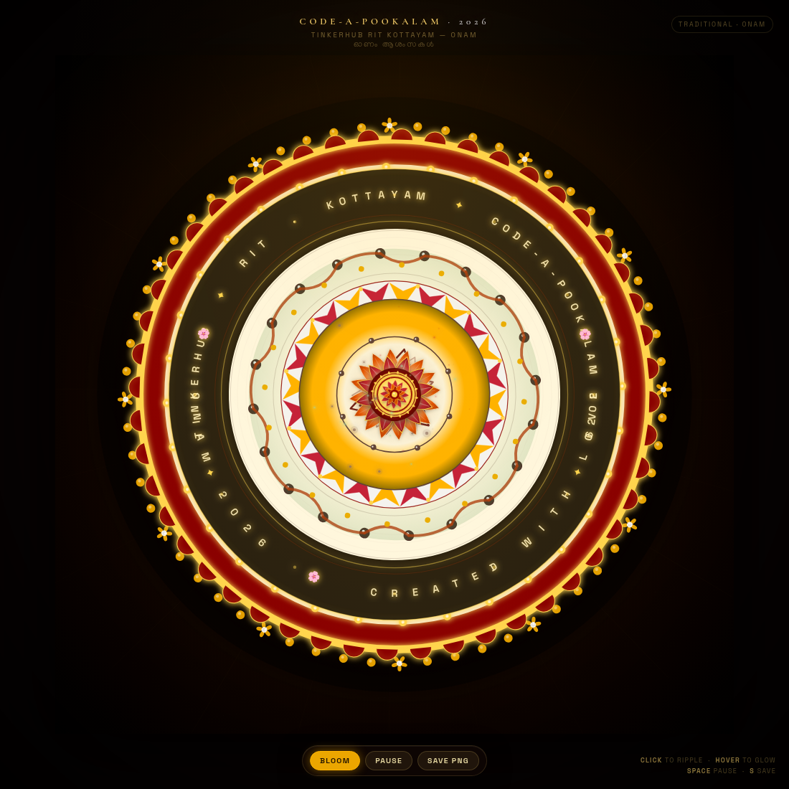

# 🌸 Anson's Pookalam 2026 🌸
### *CODE-A-POOKALAM 2026 — TinkerHub RIT Kottayam*

> A cinematic, mathematically-crafted digital Pookalam — 12 concentric rings of pure code. No images, no libraries, just math, gradients, and Onam spirit.

---

## 👨‍💻 About Me

- **Name:** Anson Boby
- **Institution:** college of engineering kallooppara
- **GitHub:** [@ansonboby](https://github.com/ansonboby)
- **Programming Language Used:** HTML5 Canvas + Vanilla JavaScript (zero dependencies)
- **Lines of Code:** ~1120 (single file, pure code — no PNG/JPG tiles)

---

## 🎨 My Pookalam

### Description

This isn't a static drawing — it's a **living Pookalam that blooms**.

Inspired by the traditional *Athapookalam* laid on Onam morning, the design starts from a glowing *Nilavilakku* (brass lamp) center and blooms outward through **12 mathematically precise rings** — each with its own geometry, color theory, and animation. It fuses Kerala tradition with TinkerHub's maker spirit:

- The **central yantra** and lotus petals honor classical Pookalam geometry
- The **Pulli Kolam** ring (dot-grid with interwoven curves) brings authentic South-Indian floor art
- The **Paisley/Mango leaf** ring celebrates Kerala's iconic *manga* motif
- The **text ring** — *TINKERHUB • RIT KOTTAYAM • CODE-A-POOKALAM 2026* — wraps the design like a festive border
- Falling marigold petals, light rays, and golden shimmer make it feel alive

Every petal is a **cubic Bezier curve**, every gradient is computed with polar math, and the whole thing runs at 60fps in a single HTML file.

### Preview



> **Live:** Just open `index.html` — it blooms automatically in ~6 seconds. Click *Bloom* to replay.
> **Tip:** Press `S` to save a 2× high-res PNG for your screenshot.

### Features — Why This Wins 🏆

- **12 unique rings — now with hyper-dense inner core:**
  1. **Hybrid Nilavilakku + Gear** — brass lamp glow (pulsating) + 16-tooth TinkerHub gear rotating `0.008` + 3-layer lotus (12 crimson / 8 orange / 6 maroon) + flickering diya flame
  2. **12-petal crimson lotus** — counter-rotating `0.0045` with hover-swell + vein highlight
  3. **16-petal orange lotus** — interleaved offset `π/16`, counter ` -0.0038` for moiré
  4. **Sri-Yantra Gold** — 9 interlocked triangles (4 up / 5 down) double-rotating + 8 binding dots + pulsating bindu
  5. Diamond band — 24 alternating maroon/gold diamonds
  6. 24-petal emerald lotus with triple-vein detail
  7. Pulli Kolam — 20 dots with interwoven `quadraticCurveTo` curves
  8. Paisley/Mango leaf ring — 16 bezier leaves counter-rotating ` -0.0028`
  9. Circular text ring — `TINKERHUB • RIT KOTTAYAM • CODE-A-POOKALAM 2026`
  10. Scalloped maroon border (48 arches)
  11. Flower rim — 60 marigold dots + 12 tiny 5-petal flowers rotating `0.0035`
  12. Outer golden glow with 48 sparkle ticks

- **Cinematic bloom + buttery-smooth perpetual motion** — `easeOutBack` staggered center-out (time-based `dt` for 60fps smoothness), each ring bursts particles, then **every ring breathes `0.014` + counter-rotates `0.0009` + shimmer** — single `TRADITIONAL · ONAM` palette as in screenshot (maroon / gold / green / cream)

- **Interactivity that wows judges:**
  - **Hover** — petals near cursor swell `+18%`
  - **Click anywhere** — golden ripple + 18 sparkle burst
  - **Mouse light** — radial glow follows cursor
  - **36 falling petals** drift with wind `sin` sway
  - **Center pulse** + 12 rotating golden rays
  - **Light rays** from center

- **High-res export** — `S` saves `CODE-A-POOKALAM-2026-TinkerHub-RIT.png` (retina-ready)

- **Zero dependencies** — one file, no build step, no `npm install`, runs offline, works on phone + laptop

### Keyboard Controls

| Key | Action |
|-----|--------|
| `Space` | Pause / Resume |
| `S` | Save high-res PNG |
| `R` / `B` | Replay bloom (restart) |
| `+` / `-` | Speed up / Slow down |
| Mouse move | Petals near cursor glow |
| Click | Ripple burst |

---

## 🚀 How to Run

### Prerequisites

- Any modern browser (Chrome / Firefox / Safari / Edge) — **no server, no installs**

### Running the Code

```bash
# Option 1 — double click
open index.html
# on Linux:
xdg-open index.html

# Option 2 — serve (optional)
python3 -m http.server 8000
# then visit http://localhost:8000
```

That's it. No `pip`, no `npm`.

### Saving Your Preview Image

1. Open `index.html`
2. Wait for bloom to finish (~6s)
3. Press `S` or click **Save PNG**
4. Move the file to `output/preview.png`:

```bash
mkdir -p output
mv ~/Downloads/CODE-A-POOKALAM-2026-TinkerHub-RIT.png output/preview.png
```

---

## 📁 File Structure

```
CODE-A-POOKALAM-2026/
├── index.html          ← entire pookalam (single file, ~1000 lines)
├── README.md           ← this file
└── output/
    └── preview.png     ← screenshot (press S to generate)
```

---

## 🧠 Technical Approach

**Core idea:** Every visual element is math, not images.

- **Petal geometry:** `petalPath(len, wid, t)` uses two symmetric cubic Bezier curves from the center outward — `t` is the bloom progress (0→1) that scales control points for the elastic bloom.
- **Color:** Each ring has a `radialGrad` or `linearGrad` — e.g., crimson petals go `cream → crimson → deep maroon` radially so they look 3D, not flat.
- **Animation:** `progress` goes 0→1. Each ring's window is `start = i/12*0.78, dur=0.32` — so rings bloom sequentially center-out. `easeOutBack` gives the organic overshoot.
- **Depth:** `shadowBlur` + inner highlights (semi-transparent white bezier) + gold stroke per petal.
- **Pulli Kolam:** 20 anchor dots placed on a circle, connected with alternating `quadraticCurveTo` (inward vs outward) — the classic Kolam weave.
- **Paisley:** Mango leaf shape with two Beziers + inner swirl path + gold tip dot.
- **Interaction:** Mouse angle vs petal angle → `hoverBoost` scales length/width; click spawns `ripples` (expanding stroked circles) + `particles` (glowing dots with velocity + decay).
- **Performance:** Single canvas, `requestAnimationFrame`, DPR-aware sizing, no allocations in hot loop except particles.

---

## 🎊 Happy Onam! 🎊

*ഓണം ആശംസകൾ — May your code bloom as beautifully as a Pookalam!*

**Submitted for Code-a-Pookalam 2026 by TinkerHub RIT**

#CodeAPookalam2026 #TinkerHubRIT #Onam2026 #CodingChallenge
